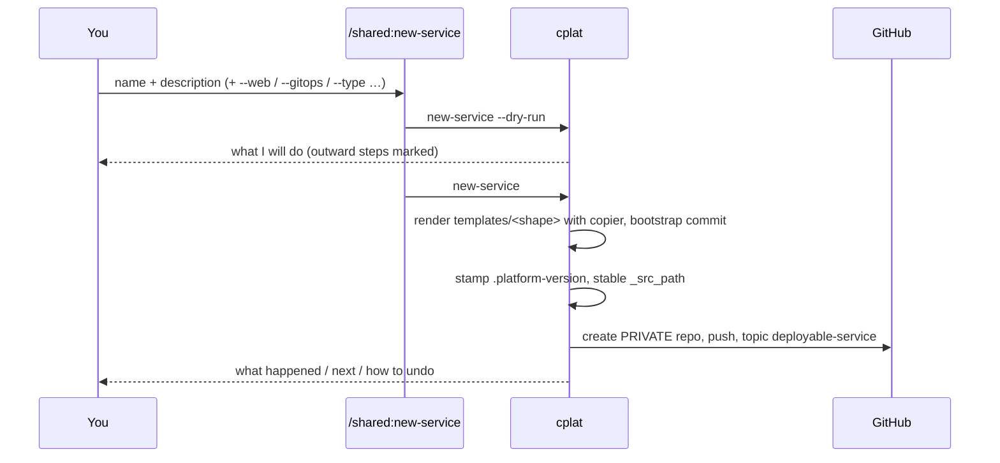
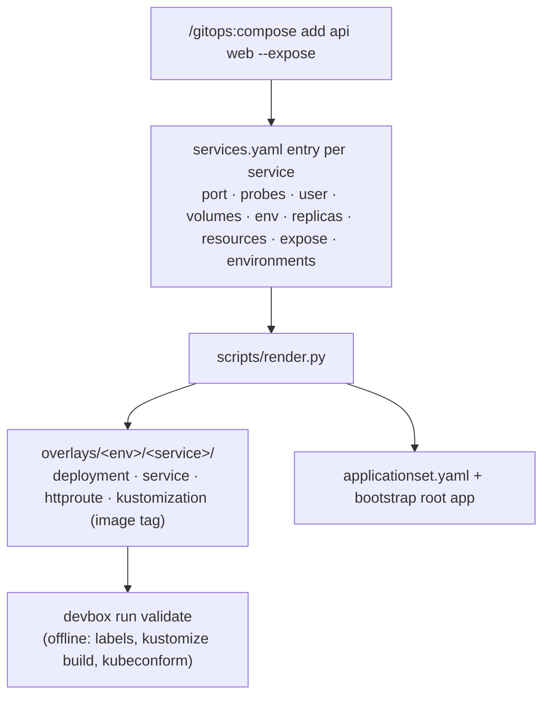
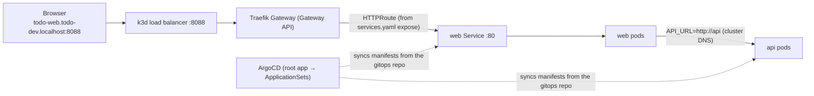

# How it works

What actually happens when you use the platform — read this when a command surprises you. For the guided tour see [USER-JOURNEY](USER-JOURNEY.md); for decisions see the ADRs.

## The moving parts

Commands are thin: they run `cplat` with `--dry-run`, show you the plan, run it, and relay the report. Anything that can be code is code (and has tests); agents do the creative work (design, implement, review).

## 1. Create a repo — `/shared:new-service`

The shape (`service-python`, `web-nextjs`, `gitops-app`, …) is looked up in `shapes.yml`; it decides the template, the plugin whose agents work on the repo, and whether the repo is deployable.

## 2. Build a feature — `/svc:build-feature`

`cplat shape` detects the shape (from `.copier-answers.yml`) and prints which agent to use for each role. Then: product-manager → architect (plan with files and dependencies) → coders in parallel git worktrees → quality ‖ tester ‖ security → container-image check → PR. CI re-runs the same `devbox run` recipes and, on merge to `main`, builds the image natively for amd64 and arm64 and publishes `latest` and `sha-<7>`.

## 3. Declare how it runs — `/gitops:compose`

Services ship only an image. The **gitops-app repo owns every Kubernetes manifest** (ADR-017):

Defaults come from `shapes.yml → runtime` and are written *into* the entry, so what you review in the PR is exactly what runs. Wiring between services (`env: {API_URL: http://api}`), replicas and resources are product configuration and live here. New services start in `dev` only.

## 4. Promote — `/gitops:promote`

`dev` runs `latest`. `promote … dev staging` adds `staging` to the service and pins `sha-<7>` of a build of the service's `main`; `promote … staging prod` pins the release image `X.Y.Z` (the `vX.Y.Z` git tag without the `v`). Before opening the PR the script checks the tag exists in GHCR, so a promotion can never point at an image CI has not finished. One PR per invocation; rollback = revert.

## 5. Run it and reach it

`devbox run cluster-up` builds this locally: k3d, ArgoCD, Traefik's Gateway provider, your `gh` token as repo credential and GHCR pull secret, the root Application. `*.localhost` hostnames resolve to 127.0.0.1 with no DNS setup. On a real cluster a human runs `KUBE_CONTEXT=<ctx> devbox run bootstrap` once; from then on every change arrives through merged PRs and agents never run `kubectl apply`.

### Secrets

Git holds only references. `services.yaml` `secrets:` becomes `ExternalSecret`s: `generate: [DB_PASSWORD]` makes External Secrets Operator create a random value in the cluster once per environment; `remote: {keys: [STRIPE_KEY]}` reads it from the secret store (locally the `secrets-store` namespace: `/gitops:secret set <service> <secret> <KEY>`; on real clusters Vault/AWS/GCP via the store named in `app.yaml`). Pods see them as environment variables. Details: ADR-018.

### Addons (Postgres)

`/gitops:addon add postgres` declares a database for the application; a service opts in with `uses: [postgres]` (`/gitops:compose add <svc> --uses postgres`). The platform renders a CloudNativePG `Cluster` for each environment where a service uses it and injects `DATABASE_URL` and `PG*` from the operator's Secret. Removing the addon never deletes the data; backups and pooling are not provided. Details: ADR-020.

### Observability (OpenTelemetry)

`/gitops:addon add observability` puts an OpenTelemetry Collector next to your services in every environment and points them at it with the standard `OTEL_*` variables. The collector receives OTLP and scrapes each service's Prometheus endpoint. Where the data goes is your choice: `exportTo: <OTLP/HTTP endpoint>` for your own backend, or `ui: lgtm` for a local Grafana dev stack (`http://grafana.localhost:8088`, installed by `cluster-up`). Details: ADR-021.

## 6. Keep it current

- Agents/commands: `claude plugin marketplace update ika100-claude && claude plugin update <name>@ika100-claude`, then **restart Claude Code** (a running session keeps the old prompts). `/shared:doctor` tells you when that is needed.
- Skeleton (CI, Dockerfile, devbox recipes, CLAUDE.md): `/shared:update-service` re-applies the template on a review branch; project-owned files are never touched.
- Overview: `/shared:status --context <kube-context>`; setup check: `/shared:doctor`.

## What protects you (and where it is tested)

| Risk | Guard |
|---|---|
| A template regresses | `shapes.py check` (contract), `actionlint`, smoke jobs that build and start every image read-only, `tests/cplat` (unit/integration), `tests/e2e` (real cluster) |
| A promotion points at a missing image | `promote` verifies the tag in GHCR |
| Invalid Kubernetes YAML | offline `validate` in every gitops repo + server-side dry-run in the e2e test |
| A command's behaviour drifts from its docs | the command *is* the tested script; prompts only wrap it |
