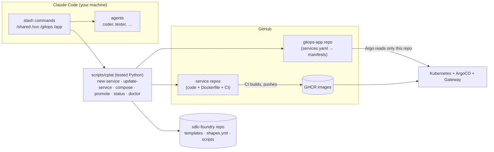
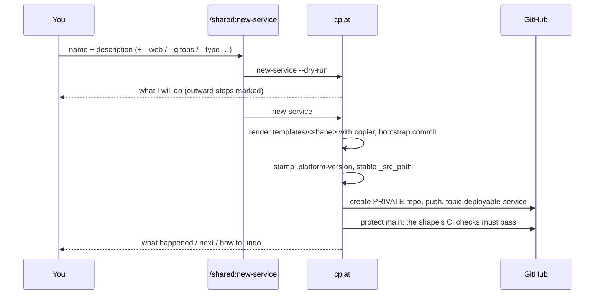
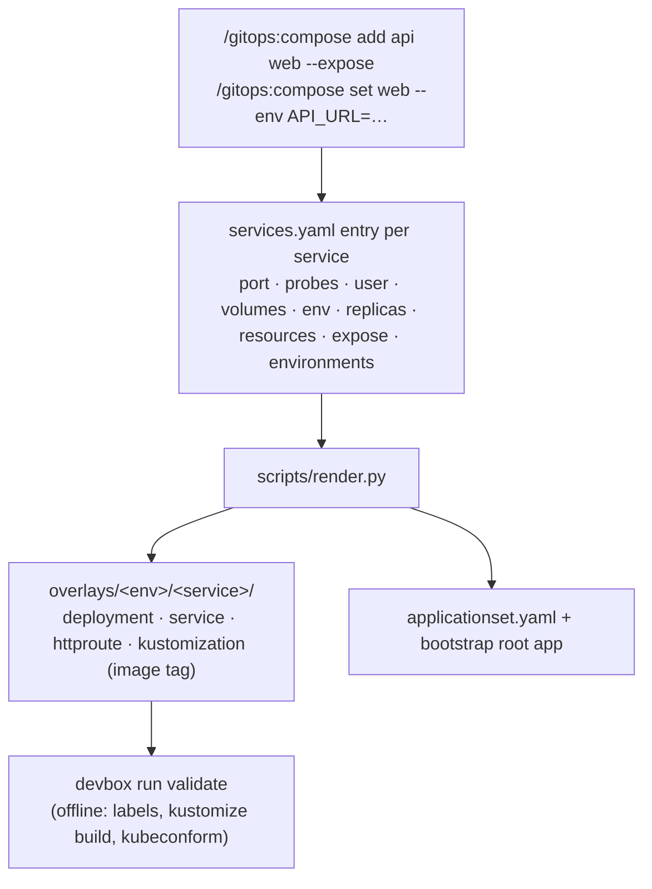
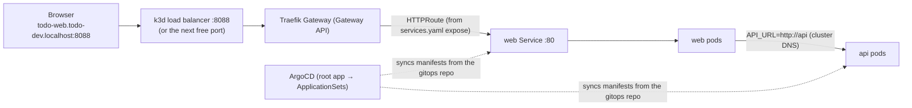

# How it works

What actually happens when you use the platform — read this when a command surprises you. For the guided tour see [USER-JOURNEY](USER-JOURNEY.md); for decisions see the ADRs.

## The moving parts

Commands are thin: they run `cplat` with `--dry-run`, show you the plan, run it, and relay the report. Anything that can be code is code (and has tests); agents do the creative work (design, implement, review).

## 1. Create a repo — `/shared:new-service`

The shape (`service-python`, `web-nextjs`, `gitops-app`, …) is looked up in `shapes.yml`; it decides the template, the plugin whose agents work on the repo, whether the repo is deployable, and which CI checks (`ci_checks`) must pass before anything merges into `main` — the repo is created with that branch protection (no review requirement; where your GitHub plan cannot protect private repos, the command warns and prints the manual step).

## 2. Build a feature — `/svc:spec`, `/svc:plan`, `/svc:build`

`cplat shape` detects the shape (from `.copier-answers.yml`) and prints which agent to use for each role. A feature is a folder `docs/specs/<NNN>-<slug>/` ([ADR-026](adr/026-feature-specs.md)): `/svc:spec` has the product-manager write `spec.md` (acceptance criteria `AC-<NNN>.<n>`, open questions that you answer, then your approval); `/svc:plan` has the architect write `design.md` and `plan.md` (tasks that `cover` criteria). `/svc:build` then writes failing acceptance tests named after the criteria, runs coders in parallel git worktrees until they pass, runs quality ‖ tester ‖ security, has a reviewer check every criterion (`verification.md`), checks the container image and opens a PR. Every check on a spec — ids, coverage, drift between spec and plan, test trace, status — is `cplat spec`, not prose. Every generated repo also runs it in CI: the warn-only `specs` workflow (`devbox run spec-check` locally) validates all specs and fails, once strict, when a criterion of a spec being built has no test. Acceptance tests may be reformatted by `lint-fix` but never weakened: the build compares them with the red commit (`cplat spec test-diff`) and stops on anything but formatting. An interrupted build resumes where it stopped (`/svc:build <id>` again). CI re-runs the same `devbox run` recipes and, on merge to `main`, builds the image natively for amd64 and arm64 and publishes `latest` and `sha-<7>`.

## 3. Declare how it runs — `/gitops:compose`

Services ship only an image. The **gitops-app repo owns every Kubernetes manifest** (ADR-017):

Defaults come from `shapes.yml → runtime` and are written *into* the entry, so what you review in the PR is exactly what runs. Wiring between services (`env: {API_URL: http://api}`), addons (`uses: [postgres]`), exposure, replicas and resources are product configuration and live here; `compose set <service>` changes them on a service that is already composed. New services start in `dev` only.

A feature built across the product with `/app:build` carries this wiring as data: the product plan's gitops-app entry lists `gitops:` operations (`{addon: postgres}`, `{uses: postgres, service: api}`, `{expose: web}`, `{env: {API_URL: http://api}, service: web}`), which `/app:build` runs with `cplat addon add` and `cplat compose set` in this repo. Its PR is marked **merge first**, because the services rely on it.

## 4. Promote — `/gitops:promote`

`dev` follows `main`: after each merge the service's CI asks the gitops-app to pin `dev` to the new `sha-<7>`; the gitops-app's `pin-dev` workflow opens that pin PR and merges it once CI passes ([ADR-027](adr/027-dev-follows-main-through-pin-prs.md)). The one manual step per service is the `GITOPS_TOKEN` secret that `/shared:new-service` names; without it `dev` stays on its last pin. `promote … dev staging` adds `staging` to the service and pins `sha-<7>` of a build of the service's `main`; `promote … staging prod` pins the release image `X.Y.Z` (the `vX.Y.Z` git tag without the `v`). Before opening the PR the script checks the tag exists in GHCR, so a promotion can never point at an image CI has not finished. One PR per invocation; rollback = revert.

## 5. Run it and reach it

`devbox run cluster-up` builds this locally (on port 8088, or the next free port when 8088 is taken — it prints the URL): k3d, ArgoCD, Traefik's Gateway provider, your `gh` token as repo credential and GHCR pull secret, the root Application. `*.localhost` hostnames resolve to 127.0.0.1 with no DNS setup. On a real cluster a human runs `KUBE_CONTEXT=<ctx> devbox run bootstrap` once; from then on every change arrives through merged PRs and agents never run `kubectl apply`.

### Secrets

Git holds only references. `services.yaml` `secrets:` becomes `ExternalSecret`s: `generate: [DB_PASSWORD]` makes External Secrets Operator create a random value in the cluster once per environment; `remote: {keys: [STRIPE_KEY]}` reads it from the secret store (locally the `secrets-store` namespace: `/gitops:secret set <service> <secret> <KEY>`; on real clusters Vault/AWS/GCP via the store named in `app.yaml`). Pods see them as environment variables. Details: ADR-018.

### Addons (Postgres)

`/gitops:addon add postgres` declares a database for the application; a service opts in with `uses: [postgres]` (`/gitops:compose add <svc> --uses postgres`). The platform renders a CloudNativePG `Cluster` for each environment where a service uses it and injects `DATABASE_URL` and `PG*` from the operator's Secret. Removing the addon never deletes the data; backups and pooling are not provided. Details: ADR-020.

### Observability (OpenTelemetry)

`/gitops:addon add observability` puts an OpenTelemetry Collector next to your services in every environment and points them at it with the standard `OTEL_*` variables. The collector receives OTLP and scrapes each service's Prometheus endpoint. Where the data goes is your choice: `exportTo: <OTLP/HTTP endpoint>` for your own backend, or `ui: lgtm` for a local Grafana dev stack (`http://grafana.localhost:8088 (or the port cluster-up prints)`, installed by `cluster-up`). Details: ADR-021.

### Guard rails (Kyverno)

Add `policies: {}` to `app.yaml` and the platform renders Kyverno policies for each environment that encode its own conventions (non-root, read-only filesystem, limits, allowed registries, no `:latest` outside dev). `devbox run validate` checks the rendered manifests against them before merge; in the cluster they run in Audit (dev, staging) or Enforce (prod). Details: ADR-022.

## 6. Keep it current

- Agents/commands: `claude plugin marketplace update sdlc-foundry && claude plugin update <name>@sdlc-foundry`, then **restart Claude Code** (a running session keeps the old prompts). `/shared:doctor` tells you when that is needed.
- Skeleton (CI, Dockerfile, devbox recipes, CLAUDE.md): `/shared:update-service` re-applies the template on a review branch; project-owned files are never touched.
- Overview: `/shared:status --context <kube-context>`; setup check: `/shared:doctor`.

## What protects you (and where it is tested)

| Risk | Guard |
|---|---|
| A template regresses | `shapes.py check` (contract), `actionlint`, smoke jobs that build and start every image read-only, `tests/cplat` (unit/integration), `tests/e2e` (real cluster) |
| A promotion points at a missing image | `promote` verifies the tag in GHCR |
| Invalid Kubernetes YAML | offline `validate` in every gitops repo + server-side dry-run in the e2e test |
| A command's behaviour drifts from its docs | the command *is* the tested script; prompts only wrap it |
