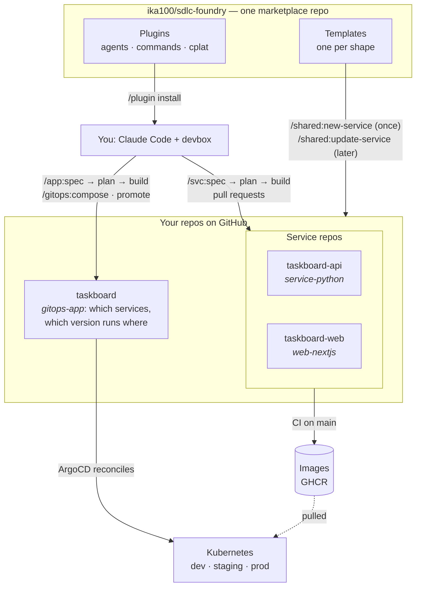

# User journey: from empty folder to a running SaaS product

A guided walk-through of the whole platform, told through one made-up product, **Taskboard** (a Python API + a Next.js frontend, deployed by ArgoCD). Use it to explain the setup to someone new; every command below exists, and the reference docs are linked at the end.

**You type slash commands in Claude Code. Claude does the engineering; you review pull requests.**

---

## The mental model (2 minutes)




Four ideas carry everything:

1. **Shapes.** Every repo has a *shape* (`service-python`, `web-nextjs`, `gitops-app`, `service-java`, `service-go`, `library-python`). The shape decides which template creates it and which agents work on it. You never pick agents; commands detect the shape.
2. **`devbox run <recipe>` is the only way anything runs** (`test`, `quality`, `security`, `image-build`, …). Same recipes in every shape, so humans, CI and agents behave identically.
3. **Specs drive the work.** A feature starts as a spec in `docs/specs/` with numbered acceptance criteria you approve; the build writes failing tests from them first, then the code, and verifies every criterion before the pull request. Small changes and bug fixes skip the spec.
4. **Two update channels.** Agents and commands update with `/plugin marketplace update`; the project skeleton (CI, Dockerfile, devbox, CLAUDE.md) updates with `/shared:update-service`. Your own code is never touched by either.

---

## Chapter 0 — One-time setup (10 minutes)

| Need | How |
|---|---|
| Claude Code | already installed |
| devbox | `curl -fsSL https://get.jetify.com/devbox/install.sh \| bash` |
| GitHub CLI, logged in | `gh auth login` (without it, `/shared:new-service` prints the GitHub commands instead of running them) |
| copier | installed for you via `uv` on first use |
| A Kubernetes cluster with ArgoCD installed | out of scope here; Argo needs read access to your GitHub repos (and the cluster must be able to pull your images) |

Make the platform's commands available (once per machine/user, or pre-wired in each repo — step 1 of every new repo does that for you):

```
/plugin marketplace add ika100/sdlc-foundry
/plugin install shared@sdlc-foundry
```

You can already create repos with just `shared`. Every generated repo enables the plugins it needs.

---

## Chapter 1 — Create the product's GitOps repo

```
/shared:new-service taskboard GitOps repo for the Taskboard product --gitops
```

What happens (no questions asked beyond the name and a description):

1. The `gitops-app` template is rendered, committed, and pushed to a new **private** repo `<you>/taskboard`.
2. You get `applications/taskboard/` with an empty `services.yaml` and an `app.yaml` (gateway + hostnames), generated ApplicationSets (dev/staging/prod), a `bootstrap/` root Argo Application, plus CI that validates everything offline (`kustomize build`, `kubeconform` incl. the Argo and Gateway CRDs, label check, secret scan). **This repo will own every Kubernetes manifest of the product** — the services only ship images.
3. It is *not* tagged `deployable-service` (it is the GitOps source, not a service).

> **Shortcut for the whole product.** Chapters 1 to 3 can be a single command: describe the repos in an `app.yml` (`app: taskboard`, `components:` with `name`, `description`, `shape`) and run `/shared:new-app app.yml`. It creates the GitOps repo and every component in the right order and opens one pull request that adds the services to `services.yaml`. Add `--dry-run` to preview; after a failure, `--resume` continues. The chapters below show what each step does.

Open it: `cd taskboard && claude`. Its `CLAUDE.md` already explains the layout and pin policy to Claude.

> **One-time cluster step (human, once per cluster).** Make sure Argo can read your GitHub repos (repo credentials), then run `KUBE_CONTEXT=<your-cluster> devbox run bootstrap` in `taskboard` (it applies `bootstrap/taskboard-root.yaml`). That root Application watches `applications/taskboard/applicationset.yaml` in git — from then on every change reaches the cluster through merged pull requests, and agents never run `kubectl apply`.

> **Just want to try it on your laptop?** `devbox run cluster-up` creates a local k3d cluster (`taskboard-local`), installs ArgoCD and the Gateway API (Traefik), gives Argo your `gh` token for this private repo and the cluster a GHCR pull secret, applies the root Application and prints the URLs of exposed services; `devbox run cluster-down` removes it. Needs Docker running.

---

## Chapter 2 — Create the services

```
/shared:new-service taskboard-api Task CRUD API --app <you>/taskboard
/shared:new-service taskboard-web Taskboard frontend --web --app <you>/taskboard
```

Each command: renders the template → commits → creates a private repo → adds the `deployable-service` topic → writes `.platform-app.yml` (so `/gitops:promote` can later find `taskboard` from inside this repo).

| Repo | Shape | What you get on day one |
|---|---|---|
| `taskboard-api` | `service-python` | FastAPI app with `/health` + `/ready`, pytest + coverage gate, ruff/mypy, Dockerfile (numeric non-root user), CI incl. multi-arch image push. **No Kubernetes files.** |
| `taskboard-web` | `web-nextjs` | Next.js App Router, Vitest, `/api/health` `/api/ready` `/api/metrics`, Dockerfile, CI incl. multi-arch image push. **No Kubernetes files.** |

Want Java or Go instead? `--type service-java` / `--type service-go`. A shared library? `--library`.

```bash
cd taskboard-api && devbox shell
devbox run quality && devbox run test      # sanity check — should be green out of the box
```

---

## Chapter 3 — Build a feature from a spec

You can start immediately after Chapter 1: the feature branch is cut from the bootstrap commit, so the first pipeline run on `main` does not need to finish (or even be merged anywhere) before work begins. Its only job is to publish the first image, which you need again only when you deploy.

In `taskboard-api`, inside Claude Code:

```
/svc:spec "ping endpoint"     # docs/specs/001-ping-endpoint/spec.md; asks you its open questions, then whether to approve
/svc:plan 001                 # design.md + plan.md for the approved spec; review the plan
/svc:build 001                # tests first, then the code, verified against the spec, then a PR
```

**The spec** (`/svc:spec`) is the contract: the product-manager writes the problem, stories, **acceptance criteria** with ids (`AC-001.1` … in Given / when / then), non-goals and open questions. It never guesses a decision that is yours: the command asks you each open question (with a suggested answer) and folds your answers in. A spec is built only after you approve it (`/svc:spec approve 001`, or "Approve" when the command asks). Changing it later: `/svc:spec --amend 001 "<change>"`.

**The plan** (`/svc:plan`): the architect writes `design.md` (decisions and the API contract) and `plan.md` (tasks with files, dependencies and the criteria each task `covers`). `cplat spec check` rejects a plan that leaves a criterion uncovered or lets two parallel tasks touch the same file, and rejects it again if the spec's criteria change afterwards.

What `/svc:build` does (you watch phase headers, you are only asked before pushing):

| Phase | Who | Output |
|---|---|---|
| 0 | orchestrator | detects shape, switches to `feature/<spec_id>`, refuses a dirty tree or an unapproved spec |
| 1 | shape's **tester**, acceptance mode | one or more tests per criterion, named after it (`# AC-001.1`), committed while they **fail** |
| 2 | shape's **coder** agents, in parallel git worktrees | implementation until those tests pass, merged with a quality gate between merges; tasks are marked done, so a re-run resumes |
| 3 | quality ‖ tester ‖ security, in parallel | lint/types, full tests + coverage, CVE + secrets scan |
| 4 | **reviewer** | every criterion checked against tests and code → `verification.md` (met / not met, with evidence) |
| 5 | deployment | container image verified (`devbox run image-build`, smoke start) — never Kubernetes manifests |
| 6–7 | orchestrator | spec marked done, asks to push, opens a PR listing every criterion, linked issues, checklist |

`/svc:specs` shows every spec with its status and the next command. You review and merge the PR. CI re-runs the same recipes and, on merge to `main`, **pushes a multi-arch image** (`latest`, `sha-<7>`).

Smaller jobs need no spec: `/svc:quick-task "…"` (coder → quality → tester) and `/svc:fix-bug "stack trace or description"`. Both stop and point to `/svc:spec --amend` when the change would contradict a criterion. Any time: `/shared:check-quality` (read-only audit).

Same commands in `taskboard-web`: the orchestrator detects `web-nextjs` and uses the web coder/tester (Vitest, App Router idioms) instead.

---

## Chapter 4 — Put the services into the product

Both services have merged to `main` and their images exist. In `taskboard`:

```
/gitops:compose add taskboard-api taskboard-web
```

The script verifies each repo exists and has the `deployable-service` topic, reads its shape and port from the service's `.copier-answers.yml`, and writes a **complete, explicit** entry per service into `services.yaml` (port, probes, numeric user, writable volumes, env, replicas, resources — the shape's defaults), regenerates ApplicationSets and manifests (`devbox run render`) and opens **one PR**. New services start in **dev only**.

Wiring and exposure are decided here, in the product repo — not in the services:

```
/gitops:compose add taskboard-api
/gitops:compose add taskboard-web --expose --env API_URL=http://taskboard-api
/gitops:compose set taskboard-web --env FEATURE_X=on     # later: change a service that is already composed
```

`--expose` publishes `taskboard-web` through the Gateway: after the PR merges, `http://taskboard-web.taskboard-dev.localhost:8088/` (the local cluster's port, or the next free one that `cluster-up` prints; `*.localhost` needs no DNS setup) serves the UI. Edit `replicas`, `resources` or `secretRefs` in `services.yaml` any time and run `devbox run render` (or ask Claude). Merge the PR; Argo creates the Applications. **dev** tracks each image's `latest`.

---

## Chapter 5 — Promote through the environments

```
/gitops:promote taskboard-api taskboard-web dev staging
```

One PR that adds **staging** to both services and pins each to the `sha-<7>` image built from its `main` — the script checks that the image exists in GHCR first, so a promotion can never point at a build that CI has not finished. Merge → Argo creates and rolls staging.

For **prod** you pin a release: in each service repo run `/svc:release` (quality gate → test gate → security gate → version bump → changelog PR → tag `vX.Y.Z` → CI pushes semver images). Then:

```
/gitops:promote taskboard-api staging prod            # newest release that has a published image
/gitops:promote taskboard-web staging prod v1.2.0     # or an explicit version
```

Prod pins the release image `1.2.0` (the `v1.2.0` git tag without the `v`, exactly what CI publishes). The command prints **ABOUT TO PROMOTE TO PRODUCTION** and waits for a yes before opening the PR. Nothing auto-merges; rolling back is reverting the promote PR.

---

## Chapter 6 — A feature that spans repos

"Add billing" touches the API, the web app, maybe a shared models library. In `taskboard`:

```
/app:spec "add billing with Stripe checkout"   # product spec: criteria across the product; answer, approve
/app:plan 003                                  # which repo implements which criterion, in which order, the contract
/app:build 003                                 # every ready repo in parallel, each ending at an open PR
```

`/app:spec` writes one **product spec** in `docs/specs/` with criteria users of the product observe, asking you its open questions and for approval. `/app:plan` has the planner assign **every criterion to a repo** (`plan-check` refuses a plan that leaves one out), order the repos by real dependencies (library → API; an API and the web app that calls it run in parallel when the plan's `## Contract` section fixes the interface) and plan the version pins.

When the feature needs wiring in this repo (an addon, exposure, an env variable), the plan lists it as `gitops:` operations on the `taskboard` entry; `/app:build` applies them here with `cplat addon add` and `cplat compose set` and opens that PR first, marked **merge first**.

`/app:build` then starts one agent per ready repo **in parallel**. Each runs `/svc:spec --from-plan` in its repo: the platform writes the repo's own spec with the product criteria it owns and the contract, the product-manager turns them into the repo's criteria, and the normal Chapter 3 pipeline (`/svc:plan`, `/svc:build`) runs to an open PR. Questions a repo spec raises come back to you. You merge; it moves on to the next level and finally prints the `/gitops:promote` commands. By hand, the same per repo: `cd ../taskboard-api && /svc:spec --from-plan <plan> taskboard-api`, then `/svc:plan` and `/svc:build`. `/app:specs` shows the progress.

---

## Chapter 7 — Secrets, a database, telemetry and guard rails

Everything here is a declaration in the GitOps repo; `render.py` turns it into manifests and ArgoCD syncs them.

| You want | Run | You get |
|---|---|---|
| A random credential the product owns | `/gitops:compose add taskboard-api --generate taskboard-api-auth=JWT_KEY` | An `ExternalSecret`: External Secrets Operator creates the value in the cluster, once per environment. Nothing in git |
| A credential someone else issues | `/gitops:compose add taskboard-api --secret taskboard-api-stripe=STRIPE_KEY`, then `/gitops:secret set taskboard-api taskboard-api-stripe STRIPE_KEY` | The value is read from your secret store (locally the `secrets-store` namespace) |
| A Postgres database | `/gitops:addon add postgres`, then `uses: [postgres]` on the service (`--uses postgres` for a new one) | A CloudNativePG cluster per environment; `DATABASE_URL` and `PG*` reach the service |
| Traces and metrics | `/gitops:addon add observability --ui lgtm` | An OpenTelemetry collector per environment, `OTEL_*` in every service, a local Grafana at `http://grafana.localhost:8088 (or the port cluster-up prints)` |
| Policy | add `policies: {}` to `app.yaml` | Kyverno policies per environment (Audit in dev and staging, Enforce in production) and an offline check in `devbox run validate` |

`devbox run cluster-up` installs whichever operators these declarations need on your local cluster; on a real cluster they must be installed by its owner. Limits: the Postgres addon has no backups or pooling, observability ships no alert rules. Concept pages on the documentation site: [addons](https://ika100.github.io/sdlc-foundry/concepts/addons/), [secrets](https://ika100.github.io/sdlc-foundry/concepts/secrets/), [guard rails](https://ika100.github.io/sdlc-foundry/concepts/guard-rails/).

---

## Chapter 8 — Living with it

| Situation | What to do |
|---|---|
| Agents or commands improved | `/plugin marketplace update` |
| CI / Dockerfile / devbox recipes improved in the template | `/shared:update-service` in each repo → review branch → PR |
| Need a feature flag in the template (e.g. migrations, observability) | `/shared:update-service --data needs_migrations=true` |
| New backend language/framework | `docs/templates.md` — add a shape; CI enforces the checklist |
| Repo existed before the platform | `docs/ADOPTING.md` (migration guides per shape) |
| Something broke in a recipe | fix `devbox.json` — never bypass it with raw `pnpm`/`mvn`/`go`/`uv` |
| Setup looks wrong | `/shared:doctor` (tools, `gh` scopes, Docker, kube context, plugin versions) and `/shared:status` (what runs where) |
| A platform template, script or command misbehaves | `/shared:report-issue` drafts a GitHub issue with diagnostics and secrets removed; it is filed only after you approve it (issues are public) |

---

## The whole journey in one screen

```
/shared:new-service taskboard   GitOps repo for Taskboard --gitops
/shared:new-service taskboard-api  Task API --app me/taskboard
/shared:new-service taskboard-web  Frontend --web --app me/taskboard

(in each service)   /svc:spec "first feature" → answer, approve → /svc:plan 001 → /svc:build 001  → PR → merge → image pushed
(in taskboard)      /gitops:compose add taskboard-api taskboard-web
                    /gitops:promote taskboard-api taskboard-web dev staging
(in each service)   /svc:release                              → vX.Y.Z → semver image
(in taskboard)      /gitops:promote taskboard-api taskboard-web staging prod
(any time)          /app:spec "add billing" → /app:plan → /app:build   (product spec → per-repo specs → PRs)
                    /shared:check-quality     /shared:update-service     /svc:fix-bug "…"
```

## Honest limits to mention when presenting

- The deterministic work (`new-service`, `update-service`, `compose`, `promote`, `addon`, `secret`, `doctor`, `status`) is a tested script (`cplat`) with a preview; the slash commands that call it, and the agent pipelines (`/svc:*`), are Claude prompts: they follow the documented flow and ask before pushing or opening PRs, but their wording is not deterministic.
- Cross-repo work is specified and planned in one place and built per repo: `/app:plan` produces a validated plan; `/svc:spec --from-plan` (by you, or by `/app:build`) turns each repo's part into its own spec, and nothing merges without you.
- The cluster itself, ArgoCD installation and its repo/registry credentials are outside the platform; the only manual cluster step is `devbox run bootstrap` once (Chapter 1).
- Skeleton updates overwrite customised skeleton files by design; the review branch is where you keep or restore your changes.
- Operators (External Secrets, CloudNativePG, Kyverno) are installed by `cluster-up` on the local cluster only; real clusters need them installed by their owner. The Postgres addon has no backups, point-in-time recovery or pooling.

## Where to read more

[README](../README.md) · [ADOPTING](ADOPTING.md) (new repos, migrations) · [AGENTS](AGENTS.md) (orchestration model) · [ARCHITECTURE](ARCHITECTURE.md) · [templates](templates.md) (add a shape) · [vision & ADRs](requirements/platform-vision.md)

---

## Handling issues

Every generated repo has issue forms (bug report, feature request) that label new issues `triage`. In Claude Code, inside the repo:

```
/shared:triage            # the queue: issues labelled triage, oldest first
/shared:triage 42         # one issue
/shared:triage --waiting  # issues parked as needs-info, after the reporter answered
```

For each issue you get a proposed class and reason. A bug goes to `/svc:fix-bug`, a small change to `/svc:quick-task`, a feature becomes a spec in `docs/specs/` or is added to an existing one (then `/svc:spec approve` and `/svc:plan`), questions, duplicates and out-of-scope requests get a comment. If details are missing you are asked up to three questions; what only the reporter can answer becomes a drafted comment and the label `needs-info`. Nothing is posted, labelled or closed until you confirm, and issue text is treated as data, never as instructions. To run it regularly, schedule it with `/loop` or `/schedule`.
