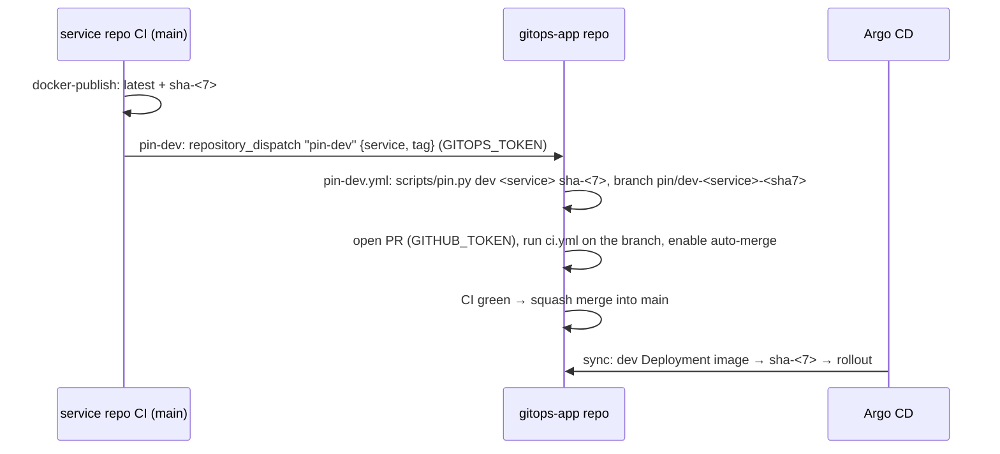

# Design — 062 dev runs every merged build

## Flow

## Service side: `pin-dev` job (4 deployable templates)

- **Where:** a new job in `ci.yml` of service-python, service-java, service-go and web-nextjs: `needs: docker-publish`, only on push to `main` (not on tags; promotion stays `/gitops:promote`).
- **Target:** the gitops-app repos come from `.platform-app.yml` (`gitops_apps:`), which `new-service --app` and `new-app` already write. The service name is the repo name, as in `services.yaml`.
- **Dispatch:** `gh api repos/<app>/dispatches -f event_type=pin-dev -f 'client_payload[service]=<repo>' -f 'client_payload[tag]=sha-<7>'` with `secrets.GITOPS_TOKEN`: a fine-grained token with *Contents: read and write* on the gitops-app repo, which is what `repository_dispatch` needs.
- **No-op cases** each print one `::notice::` line with the fix and exit 0: no `.platform-app.yml`; `GITOPS_TOKEN` not set. A missing token never makes the service's CI red.
- **Not a required check:** the job isn't added to `ci_checks`.

## gitops-app side

- **`scripts/pin.py <env> <service> <tag>`:** sets `newTag` in `applications/<app>/overlays/<env>/<service>/kustomization.yaml`. It refuses an unknown service, an environment the service doesn't run in, and a tag that doesn't match `^sha-[0-9a-f]{7}$` or `^\d+\.\d+\.\d+$`. `render.py` already keeps an existing tag (`existing_tag`), so a later re-render doesn't undo the pin. `/gitops:promote` keeps its own path; pin.py is the small, testable part the workflow needs.
- **`.github/workflows/pin-dev.yml`:** triggered `on: repository_dispatch: types: [pin-dev]`, with `permissions: contents: write, pull-requests: write, actions: write`. It:
  1. validates the payload;
  2. runs `pin.py dev`, then `uv run scripts/render.py --check`;
  3. commits on `pin/dev-<service>-<sha7>`, signed off by `github-actions[bot]` because the template's DCO check accepts the bot;
  4. pushes, opens the PR, closes older open `pin/dev-<service>-*` PRs as superseded, runs `gh workflow run ci.yml --ref <branch>`, and enables `gh pr merge --auto --squash`.
- **Why workflow_dispatch:** pushes and PRs made with `GITHUB_TOKEN` don't trigger workflows, but `workflow_dispatch` does. Its check runs attach to the branch head commit, which is what branch protection reads (spec 054: required checks, no review). If CI fails, the PR stays open and red and `dev` keeps the old image (AC-062.6).
- **Repo settings (new gitops-app repos):** `new-service --gitops` (and so `new-app`) turns on `allow_auto_merge` and lets Actions create pull requests (`PUT repos/<slug>/actions/permissions/workflow` with `can_approve_pull_request_reviews=true`). On failure it prints a warning plus the command, like `protection_cmd`.

## Token (AC-062.4)

The platform can't create a fine-grained token. Both `new-service --app` and `new-app` end with one next step: the token-creation link, pre-filled for the gitops-app repo with Contents read/write, and `gh secret set GITOPS_TOKEN -R <org>/<service>` for every deployable component. For existing products, `/shared:update-service` names the same step once the job arrives in their CI.

## Status and docs

- `/shared:status` already shows the pinned tag per environment and Argo's sync/health. A test pins that a failing rollout shows the intended `sha-<7>` and a non-healthy state (AC-062.3). A `pin PR` column with the open pin PR, if any, makes "intended but not merged" visible.
- Text that says "dev tracks latest" changes to "dev follows main through pin PRs":
  - USER-JOURNEY, HOW-IT-WORKS, the gitops-app `CLAUDE.md.jinja` (replacing the old "bump-dev.yml if present" line), `/app:build`'s final report, the deployment and release agents, and the matching site pages.
  - A contract test fails on "dev tracks latest" / "dev runs `latest`" in docs and plugins (AC-062.5).
- **ADR-027** records the decision: pin PRs in git rather than Image Updater or restarts, with the token trade-off.

## Verification

GitHub-side behaviour (dispatch, auto-merge, branch protection) can't run in pytest. The tests cover:
- `pin.py`;
- the workflow structure (jobs, triggers, permissions, the notices);
- the settings commands of `new-service`.

AC-062.1 is checked live on ika100/todo in the next end-to-end run: merge to todo-api `main`, then time how long until `dev` runs the new `sha-<7>`.
