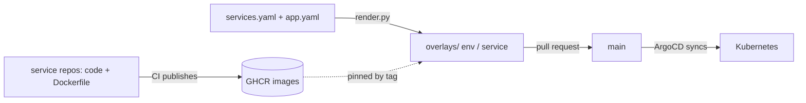

A product has one **GitOps repository** (shape `gitops-app`). It contains, per application:

- `services.yaml`: the registry of services and how each runs (image, port, probes, env, replicas, resources, secrets, addons, environments);
- `app.yaml`: how the application is exposed and which addons and policies it uses.

`scripts/render.py` derives everything else (`devbox run render`): per environment and service a Deployment, Service, optional `HTTPRoute`, `ExternalSecret`s and a `kustomization.yaml` that pins the image tag, plus the ArgoCD ApplicationSets and a root Application. `devbox run validate` fails if the tree differs from what would be rendered, so generated files cannot be edited by hand.

**Services ship only an image.** A service repository has no Kubernetes files, so Kubernetes defects cannot hide in many repositories, and nothing in CI or ArgoCD needs credentials to read other repositories ([ADR-017](/claude-platform/reference/adr/017/)).

ArgoCD owns reconciliation. Agents and scripts never `kubectl apply`; real clusters are bootstrapped once by a human.
